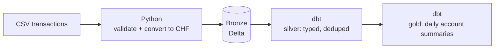

# ledger-lakehouse

> Payment-transaction lakehouse — Python ingest, dbt transforms, orchestrated as a Databricks Lakeflow job.

**Status:** 🚧 Work in progress — building in the open, TDD. See the [roadmap](#roadmap).

## What this is

A small, deliberately well-structured lakehouse pipeline for payment transactions.
The point isn't scale — it's *where each piece of logic lives*: typed, tested Python
for ingest and validation; dbt for SQL transformations; notebooks kept thin; the whole
thing scheduled as a Databricks job defined in code.

It's the follow-up to a pure-Python version ([mini-ledger]), re-homed onto a real stack.

## Architecture



The guiding rule: **Python stops once clean, validated rows are landed. dbt owns the SQL
from there.** Spark and I/O stay at the edges (the notebook), so the core Python is pure
and unit-testable in milliseconds.

## Stack

| Layer          | Tool                                   |
| -------------- | -------------------------------------- |
| Ingest + rules | Python (typed, `Decimal` money)        |
| Storage        | Delta Lake (Databricks)                |
| Transform      | dbt (`dbt-databricks`)                  |
| Orchestration  | Databricks Lakeflow job (asset bundle) |
| CI/CD          | GitHub Actions                         |

## Planned layout

```
ledger/        # Python package — ingest, validation, CHF (unit-tested)
transform/     # dbt project — silver + gold models and tests
notebooks/     # thin runners — no business logic
tests/         # pytest
databricks.yml # Lakeflow job definition (asset bundle)
```

## Getting started

> Prerequisites and steps will firm up as the project builds out.

```bash
git clone https://github.com/RamfisOrtega/ledger-lakehouse.git
cd ledger-lakehouse
# environment setup — TBD
pytest
```

## Testing

- **Python** — unit tests for validation and conversion logic (fast, no Spark).
- **dbt** — schema/data tests on the models (`not_null`, `unique`, accepted values).

## Roadmap

- [ ] Python ingest + validation (unit-tested)
- [ ] CHF conversion + missing-rate handling
- [ ] Bronze landing to Delta
- [ ] dbt silver + gold models with tests
- [ ] CI: ruff · pytest · dbt build
- [ ] Databricks Lakeflow job via asset bundle

[mini-ledger]: https://github.com/RamfisOrtega/mini-ledger